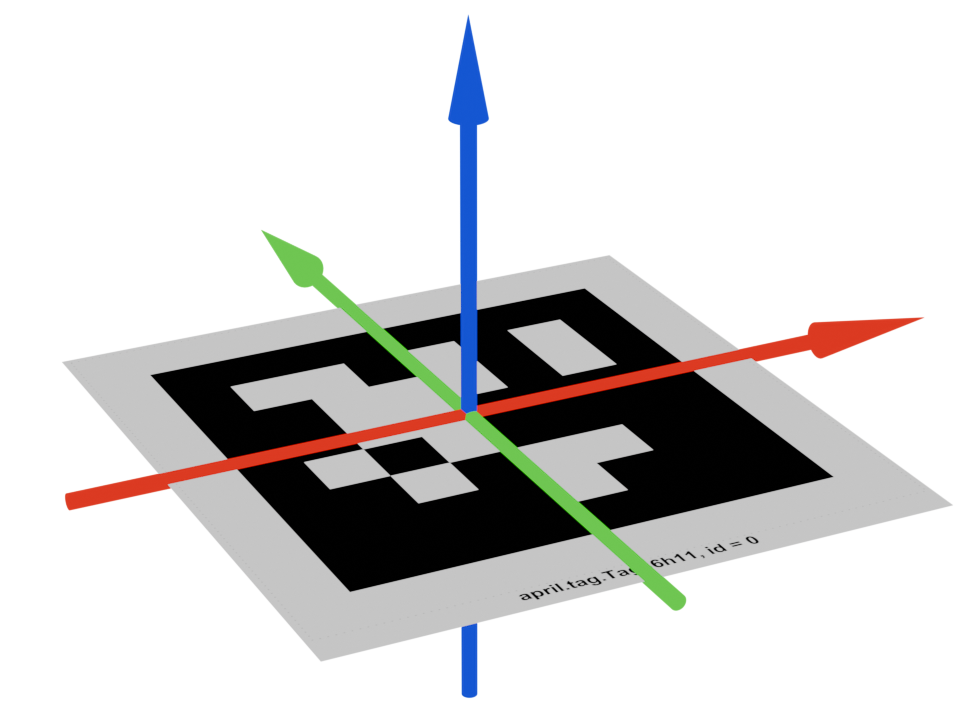

# AprilTag ROS2 Node

This ROS2 node uses the AprilTag library to detect AprilTags in images and publish their pose, id and additional metadata.

For more information on AprilTag, the paper and the reference implementation: https://april.eecs.umich.edu/software/apriltag.html

## Topics

### Subscriptions:
The node subscribes via a `image_transport::CameraSubscriber` to rectified images on topic `image_rect`. The set of topic names depends on the type of image transport (parameter `image_transport`) selected (`raw` or `compressed`):
- `image_rect` (`raw`, type: `sensor_msgs/msg/Image`)
- `image_rect/compressed` (`compressed`, type: `sensor_msgs/msg/CompressedImage`)
- `camera_info` (type: `sensor_msgs/msg/CameraInfo`)

### Publisher:
- `/tf` (type: `tf2_msgs/msg/TFMessage`)
- `detections` (type: `apriltag_msgs/msg/AprilTagDetectionArray`)

The camera intrinsics `P` in `CameraInfo` are used to compute the marker tag pose `T` from the homography `H`. The image and the camera intrinsics need to have the same timestamp.

The tag poses are published on the standard TF topic `/tf` with the header set to the image header and `child_frame_id` set to either `tag<family>:<id>` (e.g. "tag36h11:0") or the frame name selected via configuration file. Additional information about detected tags is published as `AprilTagDetectionArray` message, which contains the original homography  matrix, the `hamming` distance and the `decision_margin` of the detection.

## Configuration

The node is configured via a yaml configurations file. For the complete ROS yaml parameter file syntax, see: https://github.com/ros2/rcl/tree/master/rcl_yaml_param_parser.

The configuration file has the format:
```yaml
apriltag:                 # node name
  ros__parameters:
    # setup (defaults)
    image_transport: raw  # image format: "raw" or "compressed"
    family: 36h11         # tag family name: 16h5, 25h9, 36h11
    size: 1.0             # default tag edge size in meter
    profile: false        # print profiling information to stdout

    # tuning of detection (defaults)
    max_hamming: 0        # maximum allowed hamming distance (corrected bits)
    detector:
      threads: 1          # number of threads
      decimate: 2.0       # decimate resolution for quad detection
      blur: 0.0           # sigma of Gaussian blur for quad detection
      refine: 1           # snap to strong gradients
      sharpening: 0.25    # sharpening of decoded images
      debug: 0            # write additional debugging images to current working directory

    # (optional) list of tags
    # If defined, 'frames' and 'sizes' must have the same length as 'ids'.
    tag:
      ids:    [<id1>, <id2>, ...]         # tag IDs for which to publish transform
      frames: [<frame1>, <frame2>, ...]   # frame names
      sizes:  [<size1>, <size1>, ...]     # tag-specific edge size, overrides the default 'size'
```

The `family` (string) defines the tag family for the detector and must be one of `16h5`, `25h9`, `36h11`, `Circle21h7`, `Circle49h12`, `Custom48h12`, `Standard41h12`, `Standard52h13`. `size` (float) is the tag edge size in meters, assuming square markers.

Instead of publishing all tag poses, the list `tag.ids` can be used to only publish selected tag IDs. Each tag can have an associated child frame name in `tag.frames` and a tag specific size in `tag.sizes`. These lists must either have the same length as `tag.ids` or may be empty. In this case, a default frame name of the form `tag<family>:<id>` and the default tag edge size `size` will be used.

The remaining parameters are set to the their default values from the library. See `apriltag.h` for a more detailed description of their function.

See [tags_36h11.yaml](cfg/tags_36h11.yaml) for an example configuration that publishes specific tag poses of the 36h11 family.

## Nodes

### Standalone Executable

The `apriltag_node` executable can be launched with topic remappings and a configuration file:
```sh
ros2 run h6x_apriltag_ros2 apriltag_node --ros-args \
    -r image_rect:=/camera/image \
    -r camera_info:=/camera/camera_info \
    --params-file `ros2 pkg prefix h6x_apriltag_ros2`/share/h6x_apriltag_ros2/cfg/tags_36h11.yaml
```

### Composable Node

For more efficient intraprocess communication, a composable node is provided:
```sh
$ ros2 component types
h6x_apriltag_ros2
  AprilTagNode
```

This `AprilTagNode` component can be loaded with other nodes into a "container node" process where they used shared-memory communication to prevent unnecessary data copies. The example launch file [v4l2_36h11.launch.yml](launch/v4l2_36h11.launch.yml) loads the `AprilTagNode` component together with the `v4l2_camera::V4L2Camera` component from the [`v4l2_camera` package](https://gitlab.com/boldhearts/ros2_v4l2_camera) (`sudo apt install ros-$ROS_DISTRO-v4l2-camera`) into one container and enables `use_intra_process_comms` for both:
```sh
ros2 launch h6x_apriltag_ros2 v4l2_36h11.launch.yml
```

## Apriltag Base Pose

AprilTag's base pose (no translation or rotation) is Y-up, Z-forward, X-left.

